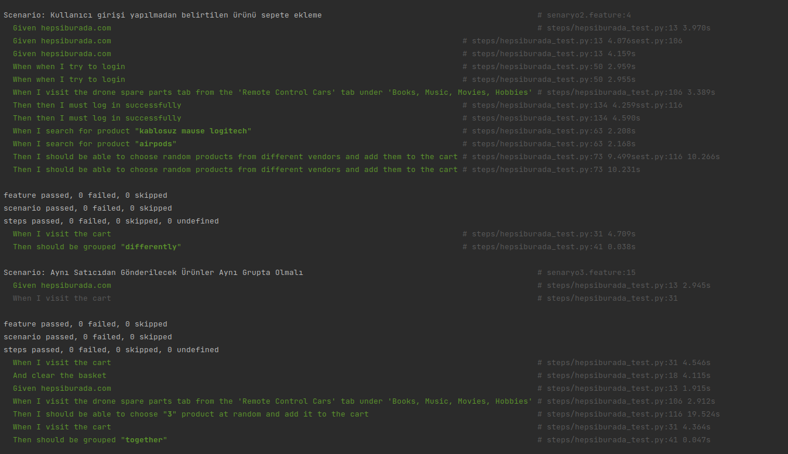

Case Study for Hepsiburada Software Test Engineer 
====

This study is a case study created for Hepsiburada using [selenium](https://pypi.org/project/selenium/), [behave](https://pypi.org/project/behave/).

The study is composed of 3 features

* senaryo1.feature : Adding a product to the cart by logging in
* senaryo2.feature : Adding the specified product to the cart without user login
* senaryo3.feature : Analysis (Delivery Options)

Installation
----------
1. Cloning the repository:

    ```shell
    git clone https://github.com/abdullahcicekli/hepsiburada_challenge.git
    ```

2. Installing all the dependencies:

    ```shell
    cd hepsiburada_challenge

    pip install -r requirements.txt
    
    cd features

Start the Test
----------
* To run cases individually, enter the feature names as `behave {scenario1.feature}`.
 
 
* Enter the `python3 multiprossesing.py` command to run the two scenarios in parallel. **(bonus)**

Description
------------
The study is composed of 3 features

* **senaryo1.feature** in order :
    - Visit Hepsiburada website.
    - Login
    - If the login is successful, it searches for the desired word (determined in the feature file).
    - Selects a random product as a result of the search.
    - If no other seller is selling the selected product, it comes back and chooses again. (The cycle continues until there is a product with different vendors.)
    - The process is finished, the browser is closed.
    
* **senaryo2.feature** in order :
    - Visit Hepsiburada website.
    - Visit the "Remote Control Vehicles" section under the "Book, Music, Movie, Hobby" category.
    - Then the "Drone Spare Parts" category is visited.
    - Adds the desired product (determined in the feature file) to the basket, which will be randomly selected from this section.
    - The process is finished, the browser is closed.
    
* **senaryo3.feature** consists of 3 parts :
  
    1. Products to be sent from different vendors should be grouped separately
    2. Products to be sent from the same seller must be in the same group
    3. Manual Cases
    
        * **CASE1** in order : 
            - Complates the Feature1
            - Then she visits the cart.
            - It checks that the products added from different vendors are in different groups. If not, it returns an error message.
            - The process is finished, the browser is closed.

        * **CASE2** in order : 
            - Complates the Feature2
            - Then she visits the cart.
            - Checks if products added from the same vendors are in the same group. If not, it returns an error message.
            - The process is finished, the browser is closed.

        * Cases related to the shipping fee whose automation is not written :
            - 50₺ and above should be free shipping
            - There should be a shipping fee of 12,99₺ for the purchase of a mobile phone, laptop, or tablet
            - The applied shipping fee should be a maximum of 12.99₺ (Abuse may occur.!)

Screenshot
------------
**Screenshot of 3 scenarios running simultaneously**


